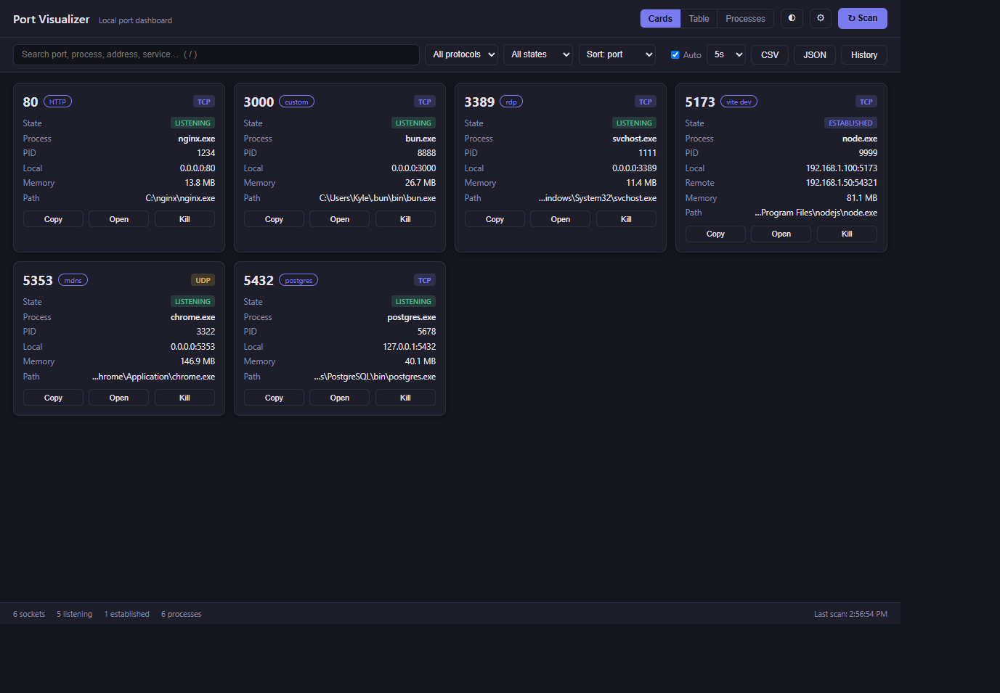

# Port Visualizer 🌐



**Port Visualizer** is a clean, modern Windows desktop application designed to help you inspect, monitor, and manage the ports active on your PC. 

No more wrestling with `netstat -ano` in the Command Prompt or digging through Task Manager. Port Visualizer provides a real-time, user-friendly dashboard showing which applications are using your network, how much memory they are consuming, and lets you terminate processes or find their executable directories instantly.

---

## Key Features

- **⚡ Fast, Structured Port Detection:** Queries active TCP/UDP ports using PowerShell's native API. If PowerShell is blocked by security policies, it automatically falls back to standard `netstat -ano` output parsing.
- **👁️ Multiple Layout Modes:** Switch layouts instantly depending on your workflow:
  - **Grid View (Cards):** Best for a quick, readable summary of each port.
  - **Table View:** Sortable, detailed list of connection details (Local/Remote address, protocol, PID, memory, state).
  - **Process-Grouped View:** Combines sockets under their owning processes, letting you expand a process to see all its ports at once.
- **🏷️ Well-Known Service Labels:** Automatically labels common ports (e.g. `5432` → `postgres`, `5173` → `vite dev`, `80` → `HTTP`) for quick identification.
- **🔄 Live Diffing & History:** Track connection changes seamlessly. When auto-refresh is active (adjustable from 2s to 30s), new or state-changed ports will flash visually, and a persistent **Session History** panel logs every opening and closing event.
- **🛡️ Secure Process Control:** Terminate processes safely with an optional child-tree kill. If Windows blocks a termination due to permissions, the app will automatically request **UAC Admin Elevation** to finish the job. Core system processes (like PIDs 0 and 4) are protected and cannot be killed.
- **📥 CSV & JSON Exports:** Export your current filtered view instantly.
- **🎨 Modern Dark/Light Theme:** Supports system-native themes, complete with keyboard shortcuts for common tasks.
- **📥 System Tray integration:** Minimize the app to the system tray to keep it running quietly in the background. The system tray icon tooltip displays the count of currently listening ports.

---

## 🚀 How to Use

### Installation
1. Go to the **[Releases](https://github.com/TheSandemon/port-visualizer/releases)** tab on GitHub.
2. Download either:
   - **`Port Visualizer Setup 1.0.0.exe`**: Installs the app on your PC (supports desktop & start menu shortcuts).
   - **`Port.Visualizer.1.0.0.exe` (Portable)**: Run the app directly without installing anything.
3. Open the app. The initial scan will run automatically!

### User Interface Tips
* **Switch Views:** Use the buttons in the header, or press `1` (Cards), `2` (Table), or `3` (Process View) on your keyboard.
* **Search / Filter:** Type a process name, port number, or IP address into the search bar, or filter by protocol (TCP/UDP) and state (LISTENING/ESTABLISHED).
* **Kill a Process:** Click the **Kill** button on any port. You'll see a confirmation prompt allowing you to kill the process and all of its child processes.
* **Find File Location:** Click **Open Location** next to the process path to jump directly to the executable in Windows File Explorer.
* **Quick Refreshes:** Click the refresh icon, or press `Ctrl + R` to run a manual scan.

### Keyboard Shortcuts
| Shortcut | Action |
| :--- | :--- |
| `Ctrl + R` | Trigger a manual scan |
| `/` | Focus the search input |
| `Esc` | Clear search or close modals |
| `1` | Switch to Cards Grid view |
| `2` | Switch to Table view |
| `3` | Switch to Process Grouped view |

---

## 🛠️ Developer Setup & Architecture

This application is built on **Electron**, **TypeScript**, and **electron-vite**.

### Directory Structure
```
src/
  ├── main/      - Electron main process (window/tray creation, PowerShell engine, taskkill, settings management)
  ├── preload/   - Safe, context-isolated bridge API exposing IPC channels to the renderer
  ├── renderer/  - Front-end UI written in vanilla TypeScript with keyed DOM updates (optimized performance)
  └── shared/    - Shared typescript declarations, IPC channel configurations, data exporters, and port maps
```

### Security Details
- The renderer runs fully **sandboxed** with `contextIsolation: true` and node integration disabled.
- Process termination is handled via `execFile` argument arrays (never shell-parsed string interpolation) to completely prevent command-injection vulnerabilities.
- File system jumps via "Open Location" only accept absolute paths that were output during the active scan, keeping the renderer from probing arbitrary paths.

### Running from Source
To run and build this project locally, ensure you have **Node.js (v20+)** installed:

```bash
# Clone the repository
git clone https://github.com/TheSandemon/port-visualizer.git
cd port-visualizer

# Install dependencies
npm install

# Run the app in development mode (supports HMR)
npm run dev

# Run unit tests
npm test

# Run code linter
npm run lint

# Compile production bundles
npm run build

# Package installer and portable executables
npm run dist
```

## License

This project is open-source and licensed under the [MIT License](LICENSE).
